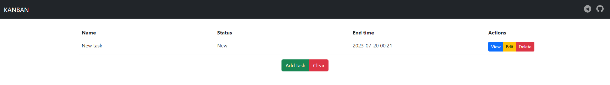

# Kanban - task manager

---
## Description
The application allows to create and edit three types of tasks:
* Task
* Epictask (can contain several small tasks)
* Subtask (part of the epictask)

Tasks are stored in memory in HashMap.

All tasks have next properties:
* Name
* Description
* Status (New/In progress/Done; status of epictask depends on the status of its subtasks)
* End time (end time of epictask is the last end time of its subtasks)

Main packages:
* controller (creating server and handling endpoints)
* service (task validation)
* repository (access to storage)

Swagger specification: /kanban-spec.json

---
## Requirements
* JDK 11
* Apache Maven 4.0.0
* Node.js 9.5.1
---
## Running
### backend

From the command line in the root directory
1. `mvn clean package`
2. `java -jar target/kanban-1.0-SNAPSHOT-jar-with-dependencies.jar`

Access backend at http://localhost:8080/api

---
### frontend

From the command line in the root directory
1. `cd frontend`
2. `npm start`

Access frontend at http://localhost:3030

---
## Used technologies
* Java (backend code)
* Apache Maven (build tool)
* React + Node.js (frontend code)
* Lombok
* Gson (serialization)
* Slf4j (logging)
* JUnit + Mockito (testing)
* com.sun.net.httpserver.HttpServer (creating server and handling endpoints)